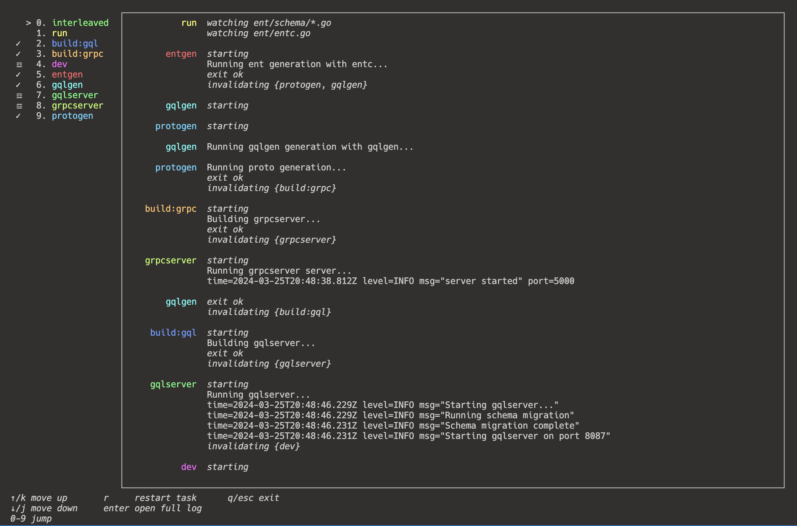
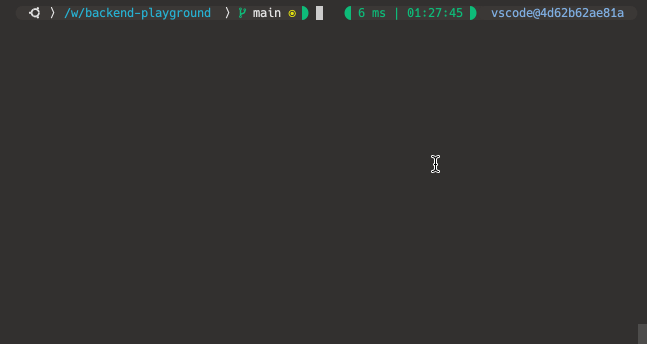

# backend-playground

This repo is a playground for backend development.

## Summary

- VSCode connected to remote host via SSH with the repository opened in a Docker container for development.
- Alternate environment on Github Codespaces using the same devcontainer configuration.
	- Ubuntu 22.04 [devcontainer](https://code.visualstudio.com/docs/devcontainers/containers) with Golang 1.22, Docker 24.0.9-1, Docker Compose 2.25.0-1
	- Based on the `base:ubuntu-22.04` devcontainer image: `mcr.microsoft.com/devcontainers/base:jammy`
	- Host docker socket accessible from the devcontainer via the docker-outside-of-docker feature.
- `User` and `Todo` models defined in `ent/schema`, basic CRUD operations generated.
- Database migrations via Ent [automatic migration](https://entgo.io/docs/versioned/intro#automatic-migration).
- GraphQL API generated from the Ent schema using the [entgql](https://entgo.io/contrib/entgql) extension.
- gRPC API generated from the Ent schema using the [entgrpc](https://entgo.io/contrib/entproto) extension.

## Roadmap
- [ ] Enable GraphQL mutations for User and Todo, write tests
- [ ] Add a `ProfileImage` field on the `User` model
    - [ ] Spin up LocalStack S3 for image storage
- [ ] Add Codespaces notes
- [ ] Audit tasks.toml and update the README
- [ ] Rework app configuration, move external configs to folder, and app config to a TOML or YAML file
- [ ] Figure out a way to log / monitor the graphql requests better.
- [ ] Add custom slog handler with formatting and colors, I have this somewhere just need to find it.
- [ ] Maybe try an AI static site generator to spin up a quick UI
- [ ] Generate a REST API with ent
- [?] Deploy sandboxed gqlserver
- [?] Dockerize everything
- [?] Iterate on prebuilding the devcontainer image, what's the best way to do that
---
- [x] Look at versioned migrations
- [x] Move grpcserver back over to Postgres
- [x] Audit `dev` run task and record demo
- [x] Write logs to file and configure Loki for log viewing
- [x] Add logging middleware to grpcserver
- [x] Generate a gRPC service with ent
- [x] Reimplement commit generator func into a standalone shell script
	- [x] Remove the script from .githooks, reset git config to default
	- ~~add configuration option or run task to show setting it as a hook.~~
	- [x] Reimplement the script in a standalone shell script, add scripts folder to PATH
	- ~~Add run task for the fancy gum output confirmation~~
	- ~~Add alias `gcg` to run the script wherever it ends up~~
- [x] Audit tasks.toml and update the README
- [x] Add an edge between User and Todo
- [x] Populate the database with dummy seed data
- [x] Generate a GraphQL API with ent

## Development Commands

- `docker compose up -d` to start the docker services (Postgres, Adminer, Loki, Grafana, ...)
- `./scripts/setup.sh` to install tools (TODO: move this into devcontainer setup)
- `./scripts/gencom.sh` to generate a commit message based on the changes staged for commit
- `go run -mod=mod entgo.io/ent/cmd/ent new <MODEL_NAME>` to generate a new model
- `run dev` to start the dev server and watch for changes

### `run`

This project uses `run` as a general task executor. Poke around the `tasks.toml` file and checkout
the [documentation](https://github.com/amonks/run) for more details. In my environment do
`run dev` and leave it running in the background to handle regenerating code and restarting
services when needed.

Here's a screenshot of the `run dev` output:

## Ent

Ent is an entity framework of the Go language developed by Facebook. The aim  of ent is to simplify the process of building and maintaining applications with large and complex data models.

Ent provides a functional API to interact with the database, allowing developers to model any database schema as a Graph of Go structs and automatically generate CRUD (Create, Read, Update, Delete) operations.

[Getting Started](https://entgo.io/docs/getting-started)

### Database Schema and Migrations

The database schema is defined in the `ent/schema` directory. Ent uses the schema to generate Go code for the database models and automatically create migrations.

To make a change to the database schema, take the following steps:

1. Update the schema in `ent/schema`.
2. `run entgen` to generate the new schema.
3. `run gqlgen` to generate graphql changes.
4. `run protogen` to generate grpc changes.
5. `run db-diff` to create a new migration file.
6. `run db-lint` to validate and lint the migration.
6. `run db-apply` to apply the migration.

## GraphQL

A GraphQL schema is generated from the ent schema. Then `go` code for a GraphQL server is generated.

`ent/entc.go`
- Uses the (entql)[https://pkg.go.dev/entgo.io/contrib/entgql] extension to generate a GraphQL schema and resolvers for the Ent models.

`gqlserver/ent.graphql`
- The generated GraphQL schema file for the Ent models.
- The schema is defined using the GraphQL Schema Definition Language (SDL).

`gqlserver/resolver.go`
- The generated GraphQL base Resolver.

`gqlserver/ent.resolvers.go`
- The generated Ent resolvers that extend the base for the different Ent models.

`gqlserver/gql-generated.go`
- The generated GraphQL types and interfaces needed to implement the resolvers and server. 

## gRPC

<!-- TODO: add docs -->

Protobuf definitions are generated from the ent schema. Then `go` code for a gRPC server is generated.

## Git Commit Message Script

This repository includes a script designed to enhance the commit process by automatically generating commit messages based on the changes staged for commit, with a focus on quality and conciseness. It uses `mods` to send the current `git diff` in addition to a custom prompt to the OpenAI API. Below are the details on how to set up and use the script. `mods-config.yml` is the config used in the script.

### Setup

- My set up is to add the `scripts/` directory to my PATH and set the OPENAI_API_KEY environment variable in this repo's .env file.
- The script uses `mods` and `gum` CLI tools to interact with the OpenAI API and generate the commit message, they can be installed by running the setup script: `./scripts/setup.sh`.
- See the config file `mods-config.yml` for all the LLM and prompt related settings.

### Usage

To use the script, stage the changes you want to commit and run it: `./scripts/gencom.sh`. 

### Resources

- [OpenAI API](https://beta.openai.com/docs/)
- [Gum](https://github.com/charmbracelet/gum)
- [Mods](https://github.com/charmbracelet/mods)

